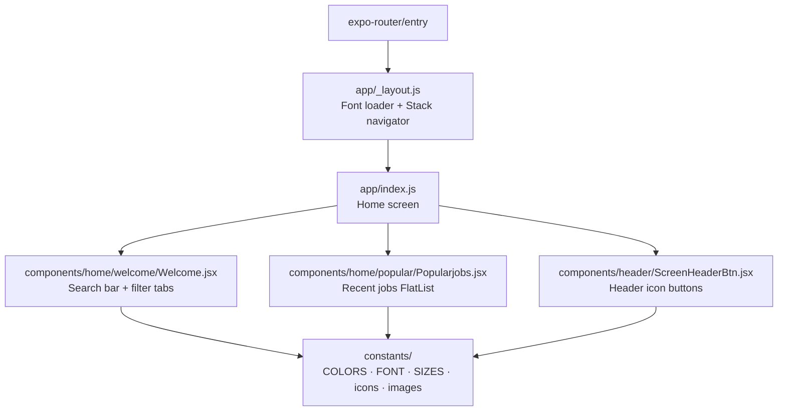

# Job App Tracker

A React Native mobile app for browsing and tracking job listings, built with Expo.


---

## Overview

Job App Tracker is a mobile-first job discovery interface built for job seekers who want a clean, focused experience on iOS and Android. The app surfaces recent job listings, lets users filter by employment type, and provides a search bar to query by keyword. It is built on Expo's managed workflow, making it runnable on physical devices via QR code without any native build toolchain.

---

## Highlights

- **Cross-platform from one codebase** — targets iOS, Android, and web simultaneously via React Native and Expo Router's file-based navigation.
- **Job type filter tabs** — horizontally scrollable Full-time / Part-time / Internships tabs with active-state styling, implemented as a stateful FlatList with dynamic style functions.
- **Consistent design system** — a centralized theme (`COLORS`, `FONT`, `SIZES`) drives every component, so spacing and typography are uniform without a third-party UI library.
- **Custom font loading with render-gating** — DM Sans (Bold, Medium, Regular) is loaded via `expo-font` at the layout level; the app withholds rendering until fonts resolve, preventing a flash of unstyled text.
- **Tunnel-first dev setup** — `npm start` runs `expo start --tunnel` via ngrok, enabling live preview on a physical device without network configuration.

---

## Features

### Discovery
- Recent jobs list rendered in scrollable, card-based layout
- Search input with a dedicated search button
- Employment type filter tabs (Full-time, Part-time, Internships)

### Navigation & Layout
- Expo Router file-based routing with a stack navigator
- Custom header with menu and profile image buttons
- Safe area insets handled via `react-native-safe-area-context`

### UI & Styling
- DM Sans typeface across all text elements
- Card shadows (iOS `shadow*` + Android `elevation`) for depth
- Active tab border color toggles driven by component state

---

## Tech Stack

| Layer | Technology | Purpose |
|---|---|---|
| Framework | React Native 0.76 | Cross-platform mobile UI |
| Dev platform | Expo 52 (managed workflow) | Build toolchain, OTA updates, device preview |
| Routing | Expo Router 4 | File-based stack navigation |
| Fonts | expo-font + DM Sans | Custom typeface loading |
| Tunneling | @expo/ngrok | Physical device preview without LAN config |
| Styling | React Native StyleSheet | Component-scoped styles with shared theme tokens |

---

## Architecture



---

## How It Works

1. **App entry** — Expo Router resolves `expo-router/entry`, which loads `app/_layout.js`.
2. **Font gating** — `_layout.js` calls `useFonts` to load DM Sans variants; the `Stack` navigator is not rendered until all fonts resolve.
3. **Home screen** — `app/index.js` composes the screen from three components: `Welcome`, `Popularjobs`, and two `ScreenHeaderBtn` instances placed in the stack header.
4. **Filter tabs** — `Welcome` maintains `activeJobType` in local state; selecting a tab updates the state and re-applies dynamic border and text color styles via style functions that receive the active type.
5. **Job list** — `Popularjobs` renders a `FlatList` of job cards. Each card shows job title and company name.
6. **Theming** — all components import from `constants/`, which exports a single source of truth for colors, font family names, and size values.

---

## Setup

**Prerequisites**

- Node.js 18+
- npm
- [Expo Go](https://expo.dev/client) app on your iOS or Android device (for physical device preview)

**Install**

```bash
npm install
```

**Run**

```bash
# Start dev server with tunnel (default — works on physical devices)
npm start

# Platform-specific emulator/simulator shortcuts
npm run android
npm run ios
npm run web
```

Scan the QR code printed in the terminal with the Expo Go app to preview on a physical device. The tunnel mode (`--tunnel`) routes traffic through ngrok so the device does not need to share a network with your machine.

---

## Usage

**Physical device preview**

1. Run `npm start`.
2. Open Expo Go on your phone and scan the QR code.
3. The home screen loads with a search bar, filter tabs, and a recent jobs list.

**Filtering by job type**

Tap any tab — Full-time, Part-time, or Internships — to set the active filter. The selected tab's border and text color update to reflect the active state.

**Searching**

Type a keyword in the search input and tap the orange search button to trigger a search (handler wired via `handleClick` prop from the parent screen).

---

## Key Decisions

| Decision | Rationale | Tradeoff |
|---|---|---|
| Expo managed workflow over bare React Native | Eliminates native build toolchain setup; enables QR-based device preview instantly | Less control over native modules; limited to Expo's supported API surface |
| File-based routing via Expo Router | Aligns navigation structure with the file system, reducing boilerplate | Requires adherence to Expo Router conventions; adds an abstraction layer over React Navigation |
| Centralized theme constants | Single source of truth for colors, fonts, and sizes avoids scattered magic values | Any theme change requires touching the constants file and re-checking all consumers |
| `useFonts` render-gate in root layout | Prevents flash of system fallback font before DM Sans loads | Adds a brief null render at startup on slow devices |
| Tunnel mode as default `npm start` | Works across different networks without LAN configuration | Adds latency to hot-reload; requires ngrok to be reachable |

---

## Innovation / Notable Work

**Dynamic style functions as first-class citizens** — rather than toggling class names or using a state-driven style object, the tab styles in `Welcome` are implemented as functions (`styles.tab(activeJobType, item)`) called directly in JSX. This pattern keeps the active/inactive visual logic co-located with the stylesheet definition and avoids conditional style merging at the render site.

**Shared design token architecture without a UI library** — the app achieves consistent typography and spacing by exporting a typed theme object (`COLORS`, `FONT`, `SIZES`) from `constants/`. Every component imports from this central module instead of defining local magic numbers, making the visual language refactorable from a single file.

---

## About

Built as a focused React Native learning project to practice Expo's managed workflow, file-based routing with Expo Router, and component-driven UI architecture with a custom design system — without reaching for third-party component libraries.
